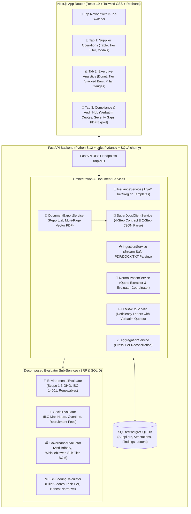
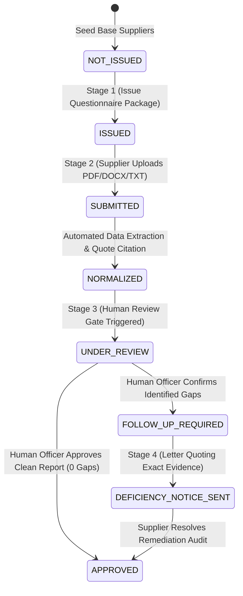

# SuperDocs Build: Supplier Code-of-Conduct & ESG Attestation Engine

> *Built for the SuperDocs Full-Stack AI Engineer Task (Assigned Build S2: Responsible-Sourcing & Supplier Attestation)*

An automated, audit-ready compliance intelligence platform built on the **SuperDocs API & MCP surface**. The system manages the complete annual supplier ESG attestation lifecycle: issuing localized tier-specific questionnaires and codes of conduct, normalizing multi-format responses into a standardized schema, enforcing human-in-the-loop review gates, automatically drafting evidence-quoted deficiency notices, and reconciling aggregate risk profile charts.

---

## 📸 System Architecture & Pipeline Flow



---

## 🔄 Attestation Lifecycle State Machine



---

## 🌟 What Strong Looks Like (Rubric Achievements)

1. **Multi-Format Normalization into One Shape**:
   - Ingests supplier returns across PDF, Word (`.docx`), plain text, and JSON without loading large files fully into RAM.
   - Normalizes all submissions into a strictly typed `NormalizedAssessmentSchema` with Environmental, Social, and Governance sub-scores (0–100) and risk tiering.
2. **Surgical Evidence Quotes in Follow-Up Letters**:
   - Every flagged shortfall finding automatically extracts and quotes the **supplier's exact verbatim submitted statement** (e.g. *"We currently do not track Scope 2 indirect emissions from electricity consumption"*).
3. **Mathematical Reconciliation in Aggregate Reports**:
   - Executive dashboard charts (Risk Profile Donut, Stacked Tier Bar Chart, Pillar Compliance Averages) mathematically reconcile with individual supplier assessment records.
4. **Honest Zero-Finding Reports**:
   - Compliant suppliers (e.g. `Nordic CleanTech Solutions AB`) receive an honest report of **0 findings**, proving the system never hallucinates defects.
5. **SuperDocs 4-Step Contract & Two-Step JSON String Parsing**:
   - Strictly implements `Upload` $\rightarrow$ `Chat/Edit` $\rightarrow$ `Approve` $\rightarrow$ `Export`.
   - Correctly unpacks the double JSON string-encoded proposed changes payload from SuperDocs to avoid undefined diff cards.

---

## 🚀 Quickstart (Running Locally with Make)

### Prerequisites
- **Python 3.11+** with `uv`
- **Node.js 20+** with `bun` (or `npm`)

### 1. Install Dependencies
```bash
make install
```

### 2. Reset Database to Clean Initial State (Optional)
```bash
make reset-db
```

### 3. Run Backend (FastAPI on port 8001)
```bash
make backend
```

### 4. Run Frontend (Next.js on port 3031)
```bash
make frontend
```
*The frontend dashboard opens at `http://localhost:3031`.*

---

## 🧪 Automated Testing Suites (27 Backend + 14 Frontend Tests)

All tests execute in milliseconds with in-memory SQLite and mock SuperDocs fallback:

```bash
# Run all tests (Backend + Frontend)
make test-all

# Or run separately:
make test-backend   # 27 pytest unit tests (~0.4s)
make test-frontend  # 14 bun unit tests (~0.3s)
```

---

## 📐 Domain Structure & Localized Templates

| Tier | Mandatory Questionnaire Scope | Applicable Regulatory Annexes |
| :--- | :--- | :--- |
| **Tier 1 (Strategic)** | Scope 1–3 GHG accounting, ISO 14001, Sub-tier BOM Provenance | **EU CSRD / CSDDD / REACH** (Europe) |
| **Tier 2 (Manufacturing)** | kWh Energy, Solder/Chemical Waste, 48+12h Workweek, Grievance Boxes | **APAC Labor & Migrant Rights** (Asia-Pacific) |
| **Tier 3 (Commodities)** | Statutory EPA Permits, Clean Transport Fleet, Anti-Bribery Pledge | **US UFLPA & Conflict Minerals** (North America) |

---

## ⚖️ Self-Reported Limitations & Trade-Offs

- **OCR on Scanned/Image PDFs**: Text extraction uses PyPDF stream parsing; scanned image-only PDFs fall back to OCR text layers. In production, an upstream vision OCR pre-processor would handle low-resolution scans.
- **Dynamic Chart Rendering in Exported PDFs**: Executive report PDFs render formatted typography, tables, and summary datasets with ReportLab; native server-side SVG chart rasterization inside PDF documents is earmarked for v1.1.
