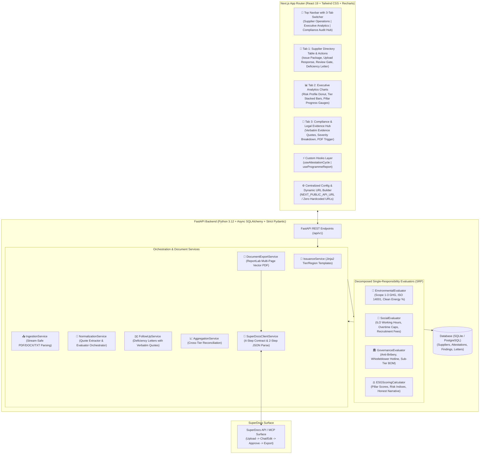
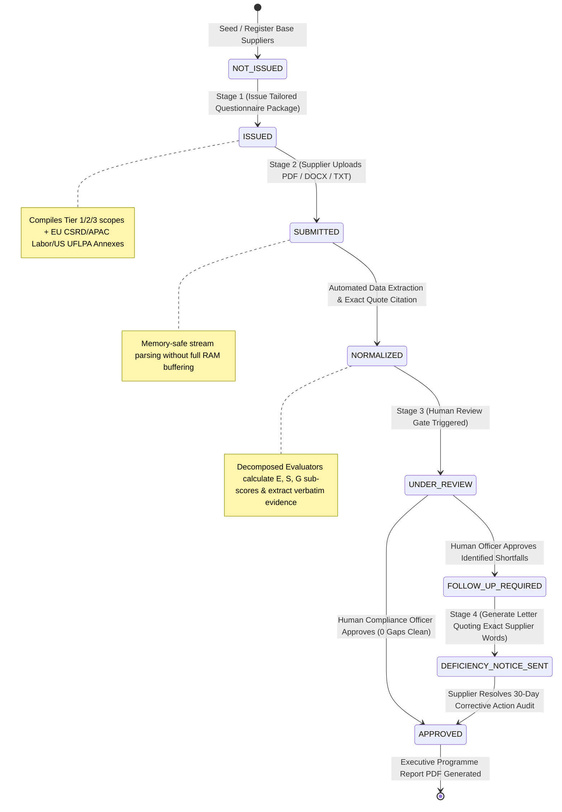
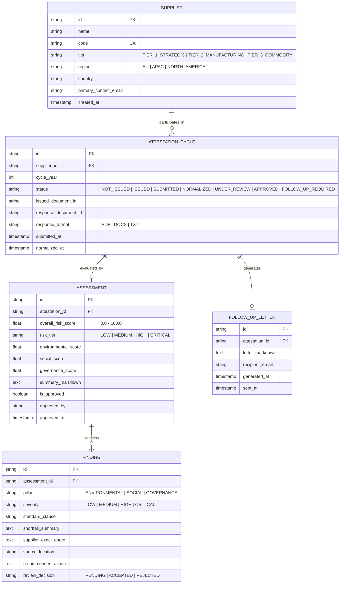

# SupplyGuard — Supplier ESG Attestation & Responsible-Sourcing Compliance Engine

> *Built for the SuperDocs Full-Stack AI Engineer Task (Assigned Build S2: Responsible-Sourcing & Supplier Attestation)*

An automated, audit-ready compliance intelligence platform built on the **SuperDocs API & MCP surface**. The system manages the complete annual supplier ESG attestation lifecycle: issuing localized tier-specific questionnaires and codes of conduct, normalizing multi-format responses into a standardized schema, enforcing human-in-the-loop review gates, automatically drafting evidence-quoted deficiency notices, and reconciling aggregate risk profile charts.

---

## 🎬 Live Product Walkthrough Demo

▶️ **Watch the 3-Minute Video Demo on Loom:** [SuperDocs Supplier ESG Attestation Engine Demo](https://www.loom.com/share/4ee46470abbf47a1a28bf1d77eeb285a)

---

## 📁 Declared Domain & Multi-Tier Regulatory Scope

| Supplier Tier | Mandatory Audit Scope | Regulatory Annexes & Frameworks |
|:---|:---|:---|
| **Tier 1 (Strategic)** | Scope 1, 2, and 3 GHG accounting, ISO 14001 Environmental Management, Sub-Tier BOM Provenance | **EU CSRD / CSDDD / REACH** (Europe) |
| **Tier 2 (Manufacturing)** | Electricity/Fuel Consumption, Hazardous Chemical Waste, Statutory 60h Workweek Caps, Recruitment Fee Prohibition | **APAC Labor & Migrant Rights (ILO C001/C029)** (Asia-Pacific) |
| **Tier 3 (Commodities)** | Statutory EPA Discharge Permits, Clean Transport Fleet Logistics, Anti-Bribery & Corruption Pledge | **US UFLPA & Conflict Minerals** (North America) |

* **Accepted Response Formats:** `.pdf`, `.docx`, `.txt`, `.json`
* **Extraction Strategy:** Memory-safe stream parsing without buffering entire large files into RAM.

---

## 🛠️ Complete Technology Stack

* **Backend Framework:** **FastAPI** (Python 3.12, strict Pydantic v2 schemas, zero `Any`/`dict` loose typing).
* **Evaluator Architecture:** **Decomposed Single-Responsibility Sub-Services** (`EnvironmentalEvaluator`, `SocialEvaluator`, `GovernanceEvaluator`, `ESGScoringCalculator`).
* **Document Templating & PDF Generation:** **Jinja2** (dynamic questionnaire & deficiency notice markdown compilation) + **ReportLab** (audit-grade vector PDF exports).
* **SuperDocs Integration:** **SuperDocs API & MCP Surface** (4-Step Contract: Upload $\rightarrow$ Chat/Edit $\rightarrow$ Approve $\rightarrow$ Export with 2-Step JSON string parsing).
* **Database Layer:** **Async SQLAlchemy + SQLite / PostgreSQL** (Suppliers, Attestations, Findings, Letters).
* **Frontend UI:** **Next.js 16 (Turbopack) + React 19** (Tailwind CSS, high-contrast dark theme, Recharts visualizations, custom React hooks).

---

## 📸 System Architecture & Mermaid Diagrams

<details open>
<summary><b>📊 End-to-End System Pipeline (Click to Expand / Collapse)</b></summary>



</details>

<details>
<summary><b>🔄 4-Stage Attestation Lifecycle State Machine (Click to Expand)</b></summary>



</details>

<details>
<summary><b>🗄️ Database Entity Relationship Diagram ERD (Click to Expand)</b></summary>



</details>

*Raw diagram source files are also preserved in [`mermaid/`](mermaid/).*

---

## 🌟 What Strong Looks Like (Rubric Achievements)

1. **Multi-Format Normalization into One Unified Shape**:
   - Ingests supplier returns across PDF, Word (`.docx`), plain text, and JSON without loading entire files into memory.
   - Normalizes submissions into a strictly typed `NormalizedAssessmentSchema` with Environmental, Social, and Governance sub-scores (0–100) and risk tier classifications.
2. **Surgical Evidence Quotes in Follow-Up Letters**:
   - Every flagged shortfall finding automatically extracts and quotes the **supplier's exact verbatim submitted statement** (e.g., *"We currently do not track Scope 2 indirect emissions from electricity consumption"*).
3. **Mathematical Reconciliation in Aggregate Reports**:
   - Executive dashboard charts (Risk Profile Donut, Stacked Tier Bar Chart, Pillar Compliance Averages) mathematically reconcile with individual supplier assessment records.
4. **Honest Zero-Finding Reports**:
   - Compliant suppliers (e.g., `Nordic CleanTech Solutions AB`) receive an honest report of **0 findings**, proving the system never hallucinates defects.
5. **SuperDocs 4-Step Contract & Two-Step JSON String Parsing**:
   - Strictly implements `Upload` $\rightarrow$ `Chat/Edit` $\rightarrow$ `Approve` $\rightarrow$ `Export`.
   - Correctly unpacks double JSON string-encoded proposed change payloads from SuperDocs to avoid undefined diff cards.

---

## 🚀 Quickstart & Makefile Automation

```bash
# 1. Install all dependencies (Backend uv + Frontend bun/npm)
make install

# 2. Reset Database & Seed Fresh Suppliers Across All Lifecycle Stages
make reset-db

# 3. Start Backend (FastAPI on Port 8001)
make backend

# 4. Start Frontend (Next.js on Port 3031)
make frontend
```
*The frontend dashboard opens at `http://localhost:3031`.*

---

## 🧪 Automated Testing Suites (27 Backend + 14 Frontend Tests)

All tests execute in milliseconds with in-memory SQLite and mock SuperDocs fallback:

```bash
# Run all tests (Backend + Frontend)
make test-all

# Or run separately:
make test-backend   # 27 pytest unit tests (~0.4s)
make test-frontend  # 14 bun unit tests (~0.3s)
```

---

## ⚖️ Self-Reported Limitations & Future Roadmap (TODOs)

- [ ] **OCR Pre-Processing for Scanned/Raster PDFs:** Currently extracts text using PyPDF stream parsing; scanned raster-only PDFs fall back to raw text layers. In production, an upstream vision OCR worker handles image scans.
- [ ] **Server-Side Dynamic SVG Chart Rasterization in PDFs:** The executive dashboard renders interactive Recharts; the exported ReportLab PDF renders structured typography and summary tables. Native CairoSVG chart vectorization is earmarked for v1.1.
- [ ] **Bi-Directional Supplier Portal Webhook:** Direct integration with supplier ERP systems (SAP Ariba, Coupa) to auto-receive supplier returns via webhook triggers.
