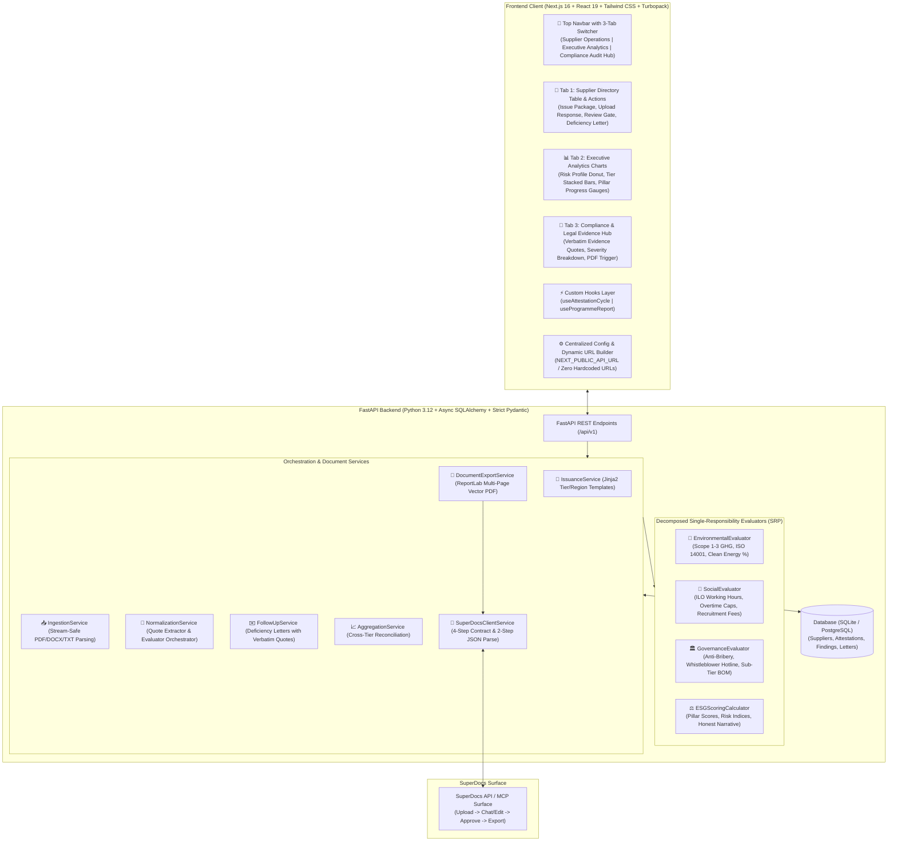
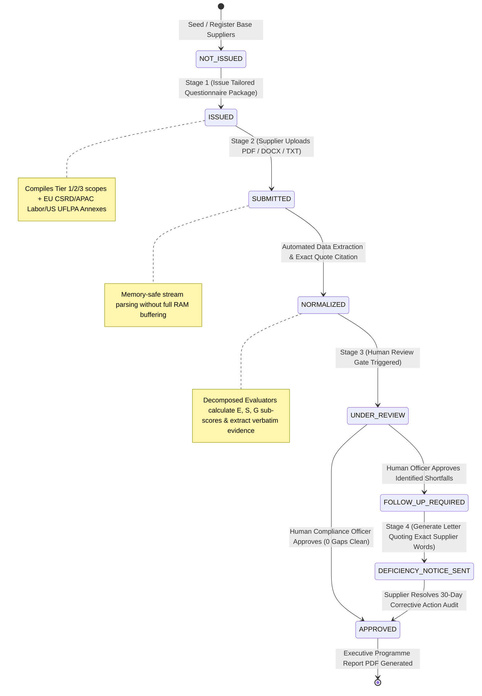
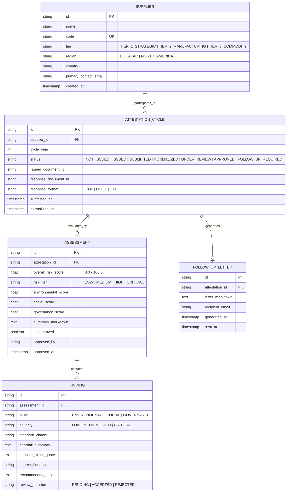

# SupplyGuard: Architecture & System Design

> **System:** Supplier ESG & Responsible-Sourcing Attestation Engine  
> **Author:** Akshat Soni | Full-Stack AI Engineer  
> **Assigned Build:** S2 (Responsible Sourcing & Supplier Attestation)

---

## 1. End-to-End System Architecture

---

## 2. 4-Stage Attestation Lifecycle State Machine

---

## 3. Database Entity Relationship Diagram (ERD)

